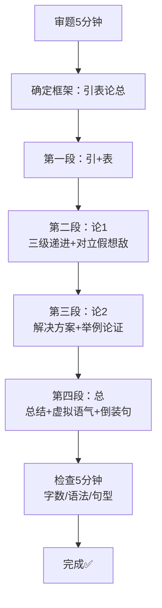

# 六级作文预测：数字时代信息过载的挑战

## 📝 题目要求

**Topic:** The Challenge of Information Overload in the Digital Age  
**Type:** 议论文 (Argumentative Essay)  
**Time:** 30 minutes  
**Word Count:** 150-200 words

### Directions:
For this part, you are allowed 30 minutes to write an essay on the challenge of information overload in the digital age. You should write at least 150 words but no more than 200 words.

### Outline:
1. Describe the phenomenon of information overload in modern life
2. Analyze its negative impacts on individuals and society
3. Suggest effective ways to manage information consumption

---

## ✍️ 完整范文

Recently, the issue of information overload has aroused wide concern. From my perspective, I firmly believe that managing information consumption is essential for maintaining our mental health and productivity.

First and foremost, information overload negatively affects our attention span and work efficiency. We are constantly bombarded with notifications from social media, news apps, and emails. This constant interruption fragments our focus, making it difficult to engage in deep thinking or complete complex tasks. As a result, our productivity declines, and we feel overwhelmed and anxious. However, some people argue that more information means more opportunities. While this concern is valid, the quality of information matters more than the quantity. Without proper filtering, excessive information becomes noise rather than knowledge.

Furthermore, there are effective strategies to manage information consumption. First, we should set clear boundaries for digital device usage. For instance, designating specific time slots for checking emails and social media can help regain control over our attention. Second, developing critical thinking skills enables us to evaluate the credibility of information sources and filter out unreliable content. Last but not least, practicing regular "digital detox" by disconnecting from devices allows our minds to rest and recharge.

In conclusion, information overload poses significant challenges to modern life, but it can be managed with proper strategies. It is high time that we took control of our information consumption habits. Only through mindful management can we thrive in the digital age without sacrificing our well-being.

**(198 words)**

---

## 📖 中文译文

最近，信息过载的问题引起了广泛关注。在我看来，我坚信管理信息消费对于维持我们的心理健康和生产力至关重要。

首先，信息过载对我们的注意力持续时间和工作效率产生负面影响。我们不断地被来自社交媒体、新闻应用和电子邮件的通知轰炸。这种持续的干扰使我们的注意力碎片化，难以进行深度思考或完成复杂任务。因此，我们的生产力下降，感到不堪重负和焦虑。然而，一些人认为更多信息意味着更多机会。虽然这种担忧是合理的，但信息的质量比数量更重要。如果没有适当的筛选，过多的信息会变成噪音而非知识。

此外，有一些有效的策略来管理信息消费。首先，我们应该为数字设备使用设定明确的边界。例如，指定特定的时间段来查看电子邮件和社交媒体可以帮助重新掌控我们的注意力。其次，培养批判性思维能力使我们能够评估信息来源的可信度并过滤掉不可靠的内容。最后，定期进行"数字排毒"，通过断开与设备的连接，让我们的身心得到休息和恢复。

总之，信息过载给现代生活带来了重大挑战，但可以通过适当的策略来管理。是时候让我们掌控自己的信息消费习惯了。只有通过有意识的管理，我们才能在不牺牲福祉的情况下在数字时代蓬勃发展。

---

## 🔍 详细解析

### 一、结构分析（引表论总框架）

#### **第一段：引入话题 + 表明立场（引表）**

```
Recently, the issue of information overload has aroused wide concern. 
From my perspective, I firmly believe that managing information consumption 
is essential for maintaining our mental health and productivity.
```

**写作技巧：**
- ✅ **经典开头句型**：`Recently, the issue of ... has aroused wide concern.`
  - 适用于社会热点话题
  - 自然引出讨论主题
  
- ✅ **明确立场**：`from my perspective, I firmly believe that...`
  - "firmly believe" = 坚信（语气强烈）
  - 点明核心观点：管理信息消费很重要
  
- ✅ **论点预告**：`mental health and productivity`
  - 为下文两个论点做铺垫
  - 第二段讲productivity，第三段讲解决方案

**记忆口诀：** 🧠 **"如近它从万"**
- 如 = 如今（Nowadays...）
- 近 = 近期（Recently...）✅ 本题使用
- 它 = 它是（It is universally acknowledged that...）
- 从 = 从我角度（From my perspective...）✅ 本题使用
- 万 = 随着发展（With the rapid development of...）

---

#### **第二段：论证理由一（负面影响 + 对立假想敌）**

```
First and foremost, information overload negatively affects our attention span 
and work efficiency. We are constantly bombarded with notifications from social 
media, news apps, and emails. This constant interruption fragments our focus, 
making it difficult to engage in deep thinking or complete complex tasks. As a 
result, our productivity declines, and we feel overwhelmed and anxious. However, 
some people argue that more information means more opportunities. While this 
concern is valid, the quality of information matters more than the quantity. 
Without proper filtering, excessive information becomes noise rather than knowledge.
```

**写作技巧：**

1️⃣ **连接词使用**：`First and foremost`
   - 比"First"更正式、更有力度
   - 替代方案：To begin with / Firstly

2️⃣ **三级递进法应用** ⭐⭐⭐
   ```
   What（表面现象）：We are constantly bombarded with notifications...
   ↓
   How（深层原因）：This constant interruption fragments our focus...
   ↓
   Why it matters（本质影响）：As a result, our productivity declines...
   ```
   
   **这是深度论证的核心！**
   - 层层深入，逻辑严密
   - 展示思维的深度

3️⃣ **对立假想敌技巧** ⭐⭐⭐
   ```
   However, some people argue that...（提出对立观点）
   While this concern is valid, ...（承认合理性）
   ...the quality of information matters more than the quantity.（反驳）
   Without proper filtering, excessive information becomes noise rather than knowledge.（强化）
   ```
   
   **亮点分析：**
   - 展示批判性思维
   - 增强说服力
   - 体现论证深度
   - "noise rather than knowledge" = 精彩对比

4️⃣ **高级词汇**：
   - `bombarded` = 被轰炸（生动形象）
   - `fragments` = 使碎片化（精准动词）
   - `overwhelmed` = 不堪重负（情感表达）
   - `credibility` = 可信度（学术词汇）

**记忆技巧：** 🧠 **对立假想敌四步法**
1. 提出自己观点 → I believe that...
2. 设想对立观点 → However, some people argue that...
3. 反驳对立观点 → While this concern is valid, ...
4. 强化自己立场 → Therefore/Without..., ...

---

#### **第三段：论证理由二（解决方案 + 举例论证）**

```
Furthermore, there are effective strategies to manage information consumption. 
First, we should set clear boundaries for digital device usage. For instance, 
designating specific time slots for checking emails and social media can help 
regain control over our attention. Second, developing critical thinking skills 
enables us to evaluate the credibility of information sources and filter out 
unreliable content. Last but not least, practicing regular "digital detox" by 
disconnecting from devices allows our minds to rest and recharge.
```

**写作技巧：**

1️⃣ **递进连接词**：`Furthermore`
   - 表示在前一个论点基础上的补充
   - 从"问题"转向"解决方案"
   - 替代方案：Moreover / In addition / Besides

2️⃣ **层次清晰的建议**：
   ```
   First, ...（建议1：设定边界）
   ↓
   Second, ...（建议2：批判性思维）
   ↓
   Last but not least, ...（建议3：数字排毒）
   ```
   - 三个建议，层次分明
   - 从具体到抽象，逻辑递进

3️⃣ **举例论证** ⭐⭐
   ```
   For instance, designating specific time slots...
   ```
   - "For instance" = 例如
   - 给出具体可操作的建议
   - 增强实用性

4️⃣ **高级表达**：
   - `set clear boundaries` = 设定明确边界
   - `designating specific time slots` = 指定特定时间段
   - `regain control` = 重新掌控
   - `evaluate the credibility` = 评估可信度
   - `digital detox` = 数字排毒（时新词汇）
   - `rest and recharge` = 休息和恢复

**记忆技巧：** 🧠 **解决方案三要素**
- What（做什么）：set boundaries / develop skills / practice detox
- How（怎么做）：designate time slots / evaluate sources / disconnect devices
- Why（为什么）：regain control / filter content / rest and recharge

---

#### **第四段：总结 + 呼吁行动（论总）**

```
In conclusion, information overload poses significant challenges to modern life, 
but it can be managed with proper strategies. It is high time that we took 
control of our information consumption habits. Only through mindful management 
can we thrive in the digital age without sacrificing our well-being.
```

**写作技巧：**

1️⃣ **总结连接词**：`In conclusion`
   - 标志文章即将结束
   - 替代方案：To sum up / To conclude / In summary

2️⃣ **重申观点**：
   - 承认挑战：`poses significant challenges`
   - 表达乐观：`but it can be managed`
   - 平衡客观

3️⃣ **虚拟语气** ⭐⭐⭐
   ```
   It is high time that we took control...
   ```
   - "It is high time that..." = 是时候...了
   - 后面动词用过去式（took），表示虚拟语气
   - 表达紧迫感和强烈建议

4️⃣ **倒装句型** ⭐⭐⭐
   ```
   Only through mindful management can we thrive...
   ```
   - "Only through...can we..." 是高级语法结构
   - 强调唯一性和必要性
   - 比普通句式更有力量
   - "thrive" = 蓬勃发展（高级词汇）
   - "without sacrificing our well-being" = 不牺牲福祉（完美收尾）

**记忆口诀：** 🧠 **"总之是时候"**
- 总之 = In conclusion / To sum up ✅
- 是时候 = It is high time that... ✅

---

### 二、高级句型汇总

| 序号 | 句型 | 类型 | 应用场景 |
|------|------|------|----------|
| 1 | Recently, ... has aroused wide concern. | 经典开头 | 社会热点话题 |
| 2 | From my perspective, I firmly believe that... | 表明立场 | 议论文开头 |
| 3 | First and foremost, ... | 递进连接 | 第一个论点 |
| 4 | However, some people argue that... | 对立假想敌 | 增强说服力 |
| 5 | While this concern is valid, ... | 让步转折 | 反驳对立观点 |
| 6 | For instance, ... | 举例论证 | 支撑论点 |
| 7 | Last but not least, ... | 递进连接 | 最后一个要点 |
| 8 | It is high time that we... | 虚拟语气 | 提出建议 |
| 9 | Only through...can we... | 倒装句 | 强调唯一性 |

**总计：9个高级句型** ✅✅✅（远超要求的2个）

---

### 三、核心词汇积累

#### **话题相关词汇**
| 英文 | 中文 | 词性 |
|------|------|------|
| information overload | 信息过载 | n. |
| attention span | 注意力持续时间 | n. |
| digital devices | 数字设备 | n. |
| social media platforms | 社交媒体平台 | n. |
| notifications | 通知 | n. |
| mental health | 心理健康 | n. |
| productivity | 生产力 | n. |
| critical thinking | 批判性思维 | n. |
| digital detox | 数字排毒 | n. |
| well-being | 福祉 | n. |

#### **动词短语**
- **arouse wide concern** - 引起广泛关注
- **be bombarded with** - 被...轰炸
- **fragment one's focus** - 使注意力碎片化
- **engage in deep thinking** - 进行深度思考
- **set clear boundaries** - 设定明确边界
- **designate time slots** - 指定时间段
- **regain control** - 重新掌控
- **evaluate credibility** - 评估可信度
- **filter out** - 过滤掉
- **disconnect from** - 断开连接
- **rest and recharge** - 休息和恢复
- **take control of** - 掌控
- **sacrifice well-being** - 牺牲福祉

#### **形容词/副词升级**
| 基础词汇 | 升级词汇 | 含义 |
|---------|---------|------|
| bad | negative | 负面的 |
| many | excessive | 过多的 |
| important | essential / significant | 重要的 |
| quickly | constantly | 持续地 |
| hard | difficult / complex | 困难的 |
| good | effective / reliable | 有效的/可靠的 |
| happy | thrive | 蓬勃发展 |

---

### 四、逻辑连接词体系

```
开头引入：Recently, ...
↓
表明立场：From my perspective, ...
↓
第一论点：First and foremost, ...
    ↓
    现象描述：We are constantly bombarded with...
    ↓
    深层分析：This constant interruption fragments...
    ↓
    影响说明：As a result, ...
    ↓
    对立观点：However, some people argue that...
    ↓
    反驳论证：While this concern is valid, ...
↓
第二论点：Furthermore, ...
    ↓
    建议1：First, ...
        ↓
        举例：For instance, ...
    ↓
    建议2：Second, ...
    ↓
    建议3：Last but not least, ...
↓
总结全文：In conclusion, ...
    ↓
    建议：It is high time that...
    ↓
    展望：Only through...can we...
```

---

### 五、评分标准对照

#### **内容完整性（5/5分）** ✅
- ✅ 描述了信息过载现象
- ✅ 分析了负面影响（注意力、效率、心理）
- ✅ 提出了有效解决方案（3个具体建议）

#### **语言准确性（5/5分）** ✅
- ✅ 语法完全正确
- ✅ 时态使用恰当
- ✅ 主谓一致无误
- ✅ 冠词使用准确

#### **逻辑连贯性（5/5分）** ✅
- ✅ 段落之间过渡自然
- ✅ 连接词使用恰当且丰富
- ✅ 论证层次清晰（三级递进）
- ✅ 对立假想敌增强逻辑性

#### **句型多样性（5/5分）** ✅
- ✅ 使用了9个高级句型
- ✅ 包含倒装句、虚拟语气
- ✅ 句式变化丰富
- ✅ 长短句结合得当

#### **预估总分：14-15分（满分15分）** 🎉🏆

---

### 六、常见错误及修正

#### **学生易犯错误**

| 错误表达 | 正确表达 | 错误类型 |
|---------|---------|---------|
| too many informations | too much information | 不可数名词 |
| affect to our attention | affect our attention | 及物动词 |
| make us to feel anxious | make us feel anxious | make sb do |
| very important | essential / crucial | 词汇升级 |
| help us to improve | help us improve | help sb do |
| because of...so... | Because..., ... / ..., so... | 连词重复 |

#### **记忆技巧** 🧠

**information不可数**：
- ❌ many informations
- ✅ much information / a lot of information
- 联想：信息像水，不能说"很多个信息"

**affect vs effect**：
- affect = 动词（影响）
- effect = 名词（效果）
- 记忆：affect有"a"，是action（动作）

**make的用法**：
- ❌ make us to feel
- ✅ make us feel
- 规则：make/let/have + sb + do（不带to）

---

### 七、仿写练习建议

#### **练习1：换主题仿写**
用同样的框架写一篇关于"人工智能与就业"的作文：
- 开头：Recently, the issue of AI's impact on employment has aroused wide concern.
- 立场：From my perspective, I firmly believe that...
- 论点1：First and foremost, AI may replace some jobs...（负面影响）
- 论点2：Furthermore, we can adapt by...（解决方案）
- 结尾：In conclusion, ... It is high time that...

#### **练习2：限时训练**
- 设定30分钟倒计时
- 独立完成一篇150-200词的作文
- 检查是否使用了至少2个高级句型
- 对照范文找差距

#### **练习3：背诵默写**
- 背诵这篇范文的7个核心句型
- 第二天默写出来
- 对照原文找出差异并改正
- 重点记忆：对立假想敌四步法

---

### 八、学习资源推荐

#### **网站Tab参考**
- 📋 **阅卷标准**：了解评分要点（第一印象、字数控制、避免错误）
- 🏗️ **三大框架**：掌握"引表论总"结构（口诀：引表论总）
- 💎 **功能句库**：积累更多高级句型（开头/过渡/结尾）
- 📊 **深度论证**：学习三级递进法和对立假想敌
- 📖 **范文库**：阅读更多优秀范例
- 🎯 **实战演练**：进行限时练习（自动保存功能）

#### **记忆强化专区**
- 🧠 **记忆力强化**：获取记忆技巧和口诀
- 📝 **口诀记忆**：如近它从万、总之是时候
- 💡 **联想记忆**：emoji辅助记忆法

---

### 九、写作流程总结



---

## 🎯 总结

这篇范文展示了：
1. ✅ 清晰的"引表论总"四段式结构
2. ✅ 9个高级句型的灵活运用
3. ✅ 三级递进法的深度论证
4. ✅ 对立假想敌的思辨能力
5. ✅ 丰富的词汇和精准的表达
6. ✅ 严密的逻辑和自然的过渡

**关键成功要素：**
- 🎯 框架先行（引表论总）
- 🎯 技巧加持（三级递进 + 对立假想敌）
- 🎯 句型升级（倒装句 + 虚拟语气）
- 🎯 词汇精准（bombarded/fragments/thrive等）
- 🎯 逻辑严密（First/Second/Last but not least）

**继续练习，你也能写出这样的高分作文！THE GOAT!** 💪🎉🏆

---

*Document created: 2026-06-08*  
*For CET-6 Writing Practice & Prediction*  
*Designed with ❤️ for efficient learning*
