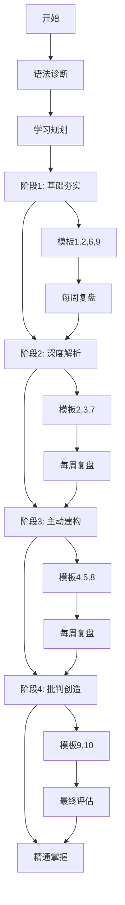
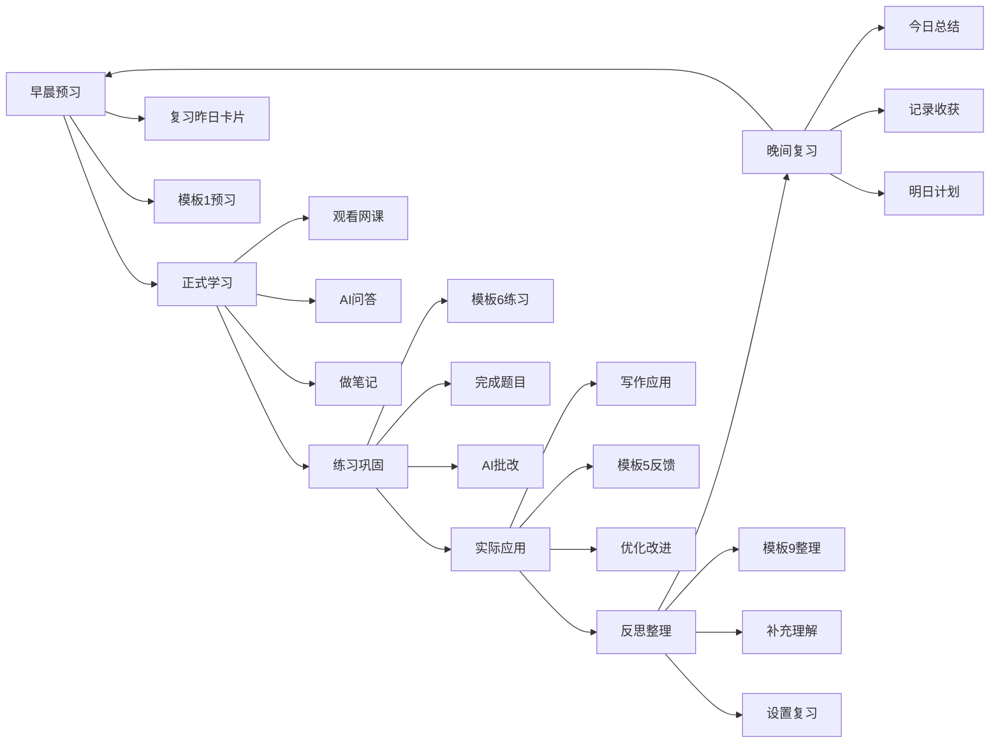

# 🗺️ AI辅助英语语法学习路线图

> **可视化学习路径** | **6周精通计划** | **高阶思维训练**

---

## 📊 总体学习路线



---

## 🎯 六周详细路线图

### 第1周：熟悉工具 + 句子骨架

```
┌─────────────────────────────────────────────┐
│           第1周：基础入门                      │
├─────────────────────────────────────────────┤
│                                              │
│  Day 1-2: 系统熟悉                           │
│  ├─ 浏览所有10个模板                          │
│  ├─ 阅读快速启动指南                          │
│  ├─ 完成第一次AI对话                          │
│  └─ 使用模板10进行自我诊断                    │
│                                              │
│  Day 3-5: 句子骨架学习                        │
│  ├─ 模板1: 理解主谓宾本质                     │
│  ├─ 观看八哥老师基础语法课                    │
│  ├─ 模板6: 生成练习题                         │
│  └─ 模板9: 整理知识卡片                       │
│                                              │
│  Day 6-7: 复习与巩固                          │
│  ├─ 复习本周知识卡片                          │
│  ├─ 模板2: 分析5个简单句                      │
│  ├─ 模板10: 周度诊断                          │
│  └─ 制定下周计划                              │
│                                              │
│  📈 预期成果:                                 │
│  ✓ 熟练使用AI工具                             │
│  ✓ 掌握句子基本结构                           │
│  ✓ 建立学习流程                               │
└─────────────────────────────────────────────┘
```

---

### 第2周：定语从句深度掌握

```
┌─────────────────────────────────────────────┐
│         第2周：定语从句专题                    │
├─────────────────────────────────────────────┤
│                                              │
│  Day 1-2: 概念理解                            │
│  ├─ 模板1: 深度解释定语从句                   │
│  ├─ 追问: 限制性vs非限制性                    │
│  ├─ 对比: which/that/who的区别                │
│  └─ 模板9: 创建知识卡片                       │
│                                              │
│  Day 3-4: 实战分析                            │
│  ├─ 模板2: 分析10个真题长难句                 │
│  ├─ 识别定语从句的位置和功能                  │
│  ├─ 模板3: 对比不同表达方式                   │
│  └─ 积累典型句型                              │
│                                              │
│  Day 5-6: 应用练习                            │
│  ├─ 模板4: 句式变换练习                       │
│  ├─ 模板6: 生成专项练习                       │
│  ├─ 写5个包含定语从句的句子                   │
│  └─ 模板5: 获取写作反馈                       │
│                                              │
│  Day 7: 总结复盘                              │
│  ├─ 模板10: 周度诊断                          │
│  ├─ 整理本周精华对话                          │
│  ├─ 完善定语从句知识库                        │
│  └─ 制定下周计划                              │
│                                              │
│  📈 预期成果:                                 │
│  ✓ 深入理解定语从句本质                       │
│  ✓ 能快速识别和分析                           │
│  ✓ 能在写作中灵活运用                         │
└─────────────────────────────────────────────┘
```

---

### 第3周：状语从句 + 名词性从句

```
┌─────────────────────────────────────────────┐
│       第3周：从句系统深化                      │
├─────────────────────────────────────────────┤
│                                              │
│  Day 1-3: 状语从句                            │
│  ├─ 模板1: 理解状语从句功能                   │
│  ├─ 分类学习: 时间/原因/条件/让步等           │
│  ├─ 模板2: 分析真题例句                       │
│  ├─ 模板6: 针对性练习                         │
│  └─ 模板9: 整理知识卡片                       │
│                                              │
│  Day 4-6: 名词性从句                          │
│  ├─ 模板1: 深度解释名词性从句                 │
│  ├─ 主语从句/宾语从句/表语从句/同位语从句     │
│  ├─ 模板3: 对比四种从句差异                   │
│  ├─ 模板4: 句式变换练习                       │
│  └─ 模板9: 整理知识卡片                       │
│                                              │
│  Day 7: 综合复习                              │
│  ├─ 对比三类从句（定语/状语/名词性）          │
│  ├─ 模板7: 苏格拉底式提问深化理解             │
│  ├─ 模板10: 周度诊断                          │
│  └─ 更新学习计划                              │
│                                              │
│  📈 预期成果:                                 │
│  ✓ 掌握三大从句系统                           │
│  ✓ 能区分不同类型从句                         │
│  ✓ 理解从句的逻辑功能                         │
└─────────────────────────────────────────────┘
```

---

### 第4周：非谓语动词专题

```
┌─────────────────────────────────────────────┐
│        第4周：非谓语动词 mastery               │
├─────────────────────────────────────────────┤
│                                              │
│  Day 1-2: 概念框架                            │
│  ├─ 模板1: 理解非谓语动词本质                 │
│  ├─ 三种形式: 不定式/分词/动名词              │
│  ├─ 对比中文表达差异                          │
│  └─ 模板9: 创建知识框架                       │
│                                              │
│  Day 3-4: 不定式深入学习                      │
│  ├─ 作主语/宾语/定语/状语/补语                │
│  ├─ 模板2: 分析真题例句                       │
│  ├─ 模板6: 专项练习                           │
│  └─ 积累高频搭配                              │
│                                              │
│  Day 5-6: 分词深入学习                        │
│  ├─ 现在分词 vs 过去分词                      │
│  ├─ 作定语/状语/补语的用法                    │
│  ├─ 模板3: 对比两种分词                       │
│  ├─ 模板4: 句式变换练习                       │
│  └─ 模板5: 写作应用反馈                       │
│                                              │
│  Day 7: 动名词 + 综合                         │
│  ├─ 动名词的用法                              │
│  ├─ 三种形式的对比和选择                      │
│  ├─ 模板10: 周度诊断                          │
│  └─ 完善非谓语动词知识库                      │
│                                              │
│  📈 预期成果:                                 │
│  ✓ 掌握非谓语动词系统                         │
│  ✓ 能正确使用三种形式                         │
│  ✓ 理解其在句子中的功能                       │
└─────────────────────────────────────────────┘
```

---

### 第5周：特殊结构 + 写作应用

```
┌─────────────────────────────────────────────┐
│      第5周：特殊结构与写作强化                 │
├─────────────────────────────────────────────┤
│                                              │
│  Day 1-2: 虚拟语气                            │
│  ├─ 模板1: 理解虚拟语气本质                   │
│  ├─ 条件句/愿望/建议等场景                    │
│  ├─ 模板2: 分析真题例句                       │
│  └─ 模板9: 整理知识卡片                       │
│                                              │
│  Day 3-4: 倒装与强调                          │
│  ├─ 部分倒装 vs 完全倒装                      │
│  ├─ 强调句型 it is...that...                  │
│  ├─ 模板3: 对比正常语序和倒装                 │
│  ├─ 模板4: 句式变换练习                       │
│  └─ 模板6: 专项练习                           │
│                                              │
│  Day 5-7: 写作综合应用                        │
│  ├─ 写一篇完整的考研作文                      │
│  ├─ 刻意使用所学语法结构                      │
│  ├─ 模板8: 模拟阅卷评分                       │
│  ├─ 模板5: 获取详细反馈                       │
│  ├─ 根据反馈修改优化                          │
│  └─ 积累高分句型和表达                        │
│                                              │
│  📈 预期成果:                                 │
│  ✓ 掌握特殊结构                               │
│  ✓ 能在写作中灵活运用                         │
│  ✓ 获得作文评分和改进方向                     │
└─────────────────────────────────────────────┘
```

---

### 第6周：综合复习 + 冲刺准备

```
┌─────────────────────────────────────────────┐
│        第6周：综合复习与冲刺                   │
├─────────────────────────────────────────────┤
│                                              │
│  Day 1-2: 全面诊断                            │
│  ├─ 模板10: 深度诊断当前水平                  │
│  ├─ 识别剩余薄弱环节                          │
│  ├─ 回顾所有知识卡片                          │
│  └─ 制定最后冲刺计划                          │
│                                              │
│  Day 3-4: 弱点攻克                            │
│  ├─ 针对薄弱项重点复习                        │
│  ├─ 模板1: 重新理解难点                       │
│  ├─ 模板6: 大量练习                           │
│  └─ 模板2: 分析相关长难句                     │
│                                              │
│  Day 5-6: 真题实战                            │
│  ├─ 做3套完整真题                             │
│  ├─ 限时完成                                  │
│  ├─ 模板2: 分析所有长难句                     │
│  ├─ 模板8: 作文评分                           │
│  └─ 总结错题和易错点                          │
│                                              │
│  Day 7: 最终总结                              │
│  ├─ 模板10: 最终评估                          │
│  ├─ 整理完整知识体系                          │
│  ├─ 制定考前复习计划                          │
│  └─ 心理建设和信心培养                        │
│                                              │
│  📈 预期成果:                                 │
│  ✓ 形成完整语法知识体系                       │
│  ✓ 具备独立分析能力                           │
│  ✓ 准备好应对考研语法考查                     │
└─────────────────────────────────────────────┘
```

---

## 🔄 每日学习循环



---

## 📋 模板使用时机图

```
学习阶段          推荐模板              使用频率
━━━━━━━━━━━━━━━━━━━━━━━━━━━━━━━━━━━━━━━━━━━━━

预习阶段          模板1 深度解释器       每次学习新知识点
                  模板7 苏格拉底提问     深度理解时

学习阶段          模板2 长难句拆解       遇到复杂句子
                  模板3 平行文本分析     对比不同表达

练习阶段          模板6 个性化练习       学完每个知识点
                  模板4 句式变换         提高灵活性

应用阶段          模板5 写作反馈         每次写作后
                  模板8 作文阅卷         完整作文后

整理阶段          模板9 知识卡片         学完每个模块
                  模板10 进度诊断        每周/每月

━━━━━━━━━━━━━━━━━━━━━━━━━━━━━━━━━━━━━━━━━━━━━
```

---

## 🎯 能力成长曲线

```
能力水平
  ↑
  │                                    ╭─── 精通
  │                                ╭──╯
  │                            ╭──╯
  │                        ╭──╯        熟练应用
  │                    ╭──╯
  │                ╭──╯
  │            ╭──╯            理解本质
  │        ╭──╯
  │    ╭──╯
  │╭──╯                    记忆规则
  └────────────────────────────────────→ 时间
   W1  W2  W3  W4  W5  W6
   
   关键转折点:
   - W2: 从记忆到理解
   - W4: 从理解到应用
   - W6: 从应用到精通
```

---

## 📊 学习里程碑

### 🏆 Milestone 1: 工具掌握（Week 1）
- [x] 能独立使用所有模板
- [x] 理解AI协作理念
- [x] 建立学习流程
- [x] 完成首次诊断

**奖励**: 继续前进的信心 💪

---

### 🏆 Milestone 2: 基础扎实（Week 2-3）
- [x] 掌握句子骨架
- [x] 理解三大从句系统
- [x] 能分析中等难度长难句
- [x] 积累20+知识卡片

**奖励**: 阅读速度提升 📖

---

### 🏆 Milestone 3: 系统构建（Week 4）
- [x] 掌握非谓语动词
- [x] 形成语法知识框架
- [x] 能解释语法规则本质
- [x] 积累50+知识卡片

**奖励**: 自信心增强 😊

---

### 🏆 Milestone 4: 应用能力（Week 5）
- [x] 掌握特殊结构
- [x] 能在写作中灵活运用
- [x] 作文获得良好评价
- [x] 积累100+高分句型

**奖励**: 写作能力提升 ✍️

---

### 🏆 Milestone 5: 精通掌握（Week 6）
- [x] 形成完整知识体系
- [x] 具备独立分析能力
- [x] 能快速解决语法问题
- [x] 准备好应对考试

**奖励**: 考研成功的基础 🎓

---

## 🎨 视觉化进度追踪

### 语法模块掌握度

```
句子骨架        ████████████████████ 100%
定语从句        █████████████████░░░  90%
状语从句        ███████████████░░░░░  75%
名词性从句      █████████████░░░░░░░  65%
非谓语动词      ████████████░░░░░░░░  60%
虚拟语气        ██████████░░░░░░░░░░  50%
倒装强调        ████████░░░░░░░░░░░░  40%
特殊结构        ██████░░░░░░░░░░░░░░  30%

目标: 所有模块达到 80%+
```

---

### 模板使用频率

```
模板1 深度解释器    ████████████████████ 高频
模板2 长难句拆解    █████████████████░░░ 高频
模板6 个性练习      ███████████████░░░░░ 中频
模板9 知识卡片      █████████████░░░░░░░ 中频
模板5 写作反馈      ██████████░░░░░░░░░░ 中频
模板4 句式变换      ████████░░░░░░░░░░░░ 低频
模板3 平行分析      ██████░░░░░░░░░░░░░░ 低频
模板10 进度诊断     ████░░░░░░░░░░░░░░░░ 低频
模板7 苏格拉底      ███░░░░░░░░░░░░░░░░░ 低频
模板8 作文阅卷      ██░░░░░░░░░░░░░░░░░░ 低频
```

---

## 💡 关键成功要素

### ✅ 必须坚持的习惯

1. **每日使用AI** - 至少一次对话
2. **及时整理笔记** - 学完即整理
3. **定期复盘** - 每周日诊断
4. **主动应用** - 写作中刻意练习
5. **持续追问** - 不满足于表面理解

### ⚠️ 需要避免的陷阱

1. ❌ 三天打鱼两天晒网
2. ❌ 只看不练
3. ❌ 直接抄答案
4. ❌ 不整理笔记
5. ❌ 不反思总结

---

## 🚀 加速技巧

### 想要更快进步？

1. **增加学习时间**
   - 从每天1小时增加到2小时
   - 周末进行深度学习（3-4小时）

2. **提高使用频率**
   - 每个模板使用至少5次
   - 每天完成一个完整学习循环

3. **深度追问**
   - 每次对话至少追问3次
   - 使用苏格拉底式提问

4. **大量实践**
   - 每天分析5个长难句
   - 每周写2篇作文

5. **社群学习**
   - 加入学习小组
   - 分享和交流心得

---

## 🎉 结语

这张路线图为你提供了清晰的学习路径，但记住：

> **路线图只是参考，真正的学习在于你的行动。**

**立即开始，持续坚持，你一定能成功！** 🌟

---

**祝你学习顺利！** 🎓✨

**最后更新**: 2026-05-05  
**版本**: v1.0
