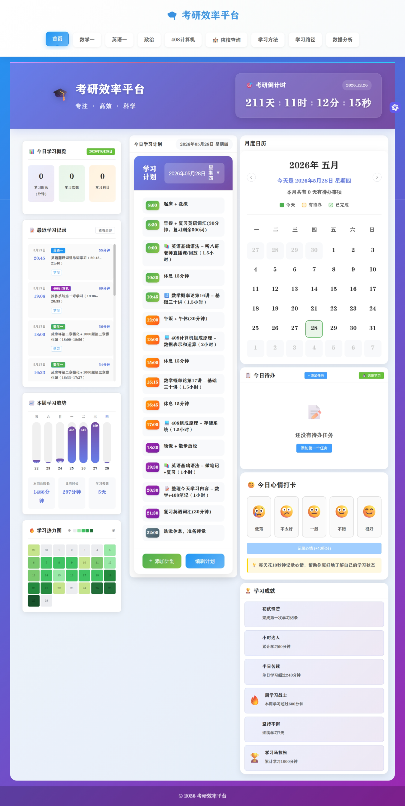

# 📚 Study Efficiency Platform (个人考研效率平台)

> A productivity tool based on CBT theory, featuring Pomodoro timer and data visualization.

## 🚀 Project Background
Designed for postgraduate entrance exam students to combat procrastination and anxiety. It focuses on personal growth by integrating **Cognitive Behavioral Therapy (CBT)** principles.

## ✨ Core Features
- **Pomodoro Engine**: Customizable focus sessions with real-time concentration tracking.
- **Data Visualization**: Integrated ECharts for learning heatmaps and task completion trends.
- **CBT Intervention**: Built-in mood diary and positive feedback激励机制.

## 🛠️ Tech Stack
- **Frontend**: Vue 3, Pinia, Element Plus, TypeScript
- **Backend**: Node.js (Express), SQLite
- **Security**: JWT Authentication, Bcrypt

## 📸 UI Showcase
*(Please replace the following placeholders with your actual screenshots)*

| Dashboard | Pomodoro Timer | Achievement System |
| :---: | :---: | :---: |
|  |  |  |

