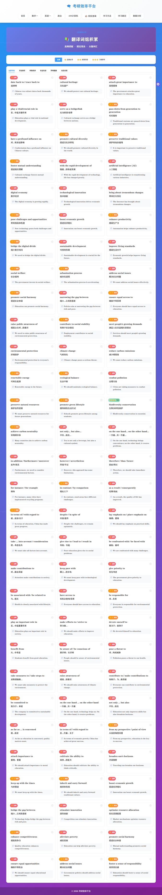
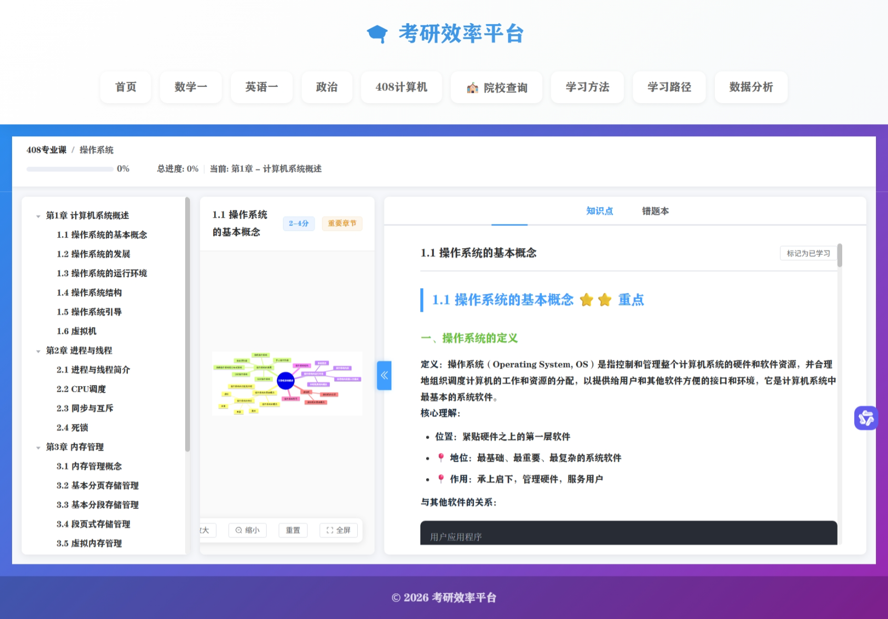
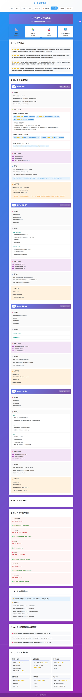
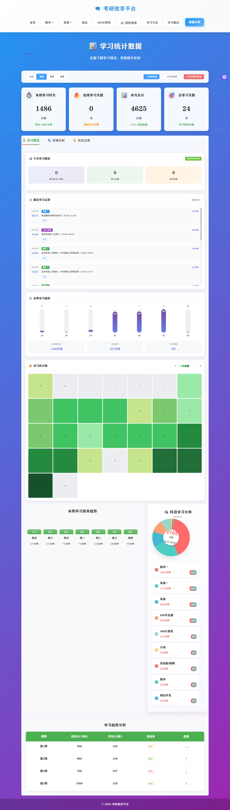

# 📚 Study Efficiency Platform (个人考研效率平台)

> A productivity tool based on CBT theory, featuring Pomodoro timer and data visualization.

## 🚀 Project Background
Designed for postgraduate entrance exam students to combat procrastination and anxiety. It focuses on personal growth by integrating **Cognitive Behavioral Therapy (CBT)** principles.

## ✨ Core Features
- **Pomodoro Engine**: Customizable focus sessions with real-time concentration tracking.
- **Data Visualization**: Integrated ECharts for learning heatmaps and task completion trends.
- **CBT Intervention**: Built-in mood diary and positive feedback激励机制.

## 🛠️ Tech Stack
- **Frontend**: Vue 3, Pinia, Element Plus, TypeScript
- **Backend**: Node.js (Express), SQLite
- **Security**: JWT Authentication, Bcrypt

## 📸 UI Showcase

### 🎯 核心功能展示

| 数据看板 | 词汇积累 | 知识图谱 |
| :---: | :---: | :---: |
|  |  |  |

| 学习指南 | 数据分析 |
| :---: | :---: |
|  |  |

**功能亮点**：
-  **数据看板**：集成学习热力图、趋势分析、番茄钟计时，可视化学习进度
- 📚 **词汇积累**：高频词组卡片化展示，支持分类筛选和例句学习
- 🧠 **知识图谱**：思维导图 + 知识点详解，支持错题本和进度追踪
- 📖 **学习指南**：四轮复习规划（基础→强化→真题→冲刺），科学备考路径
- 📈 **数据分析**：多维度学习统计，科目分布饼图、效率趋势分析

